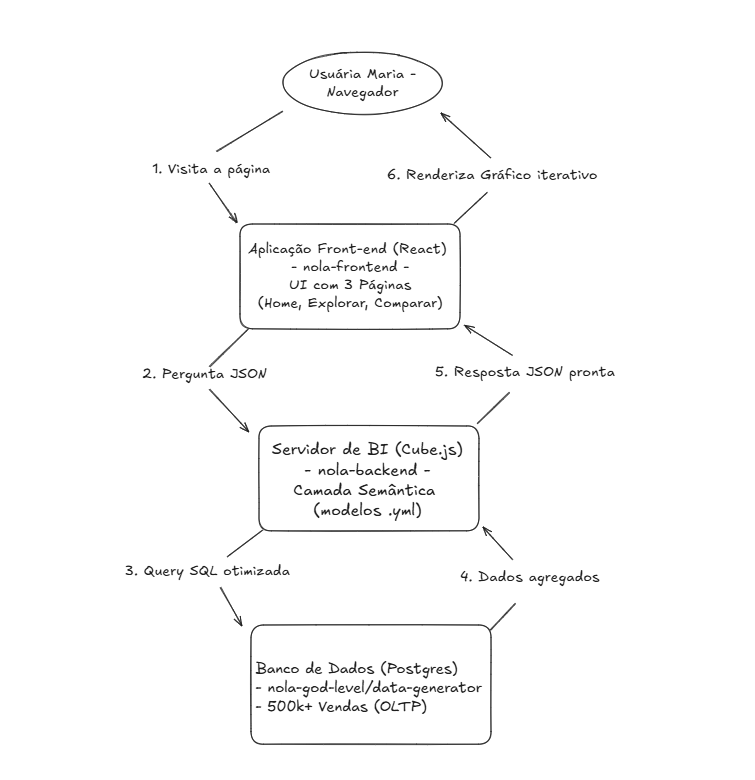
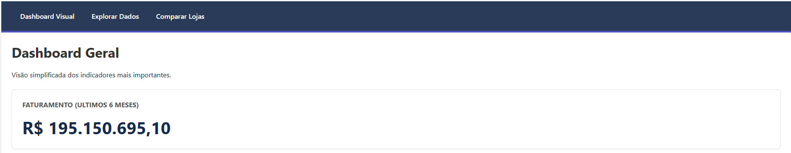
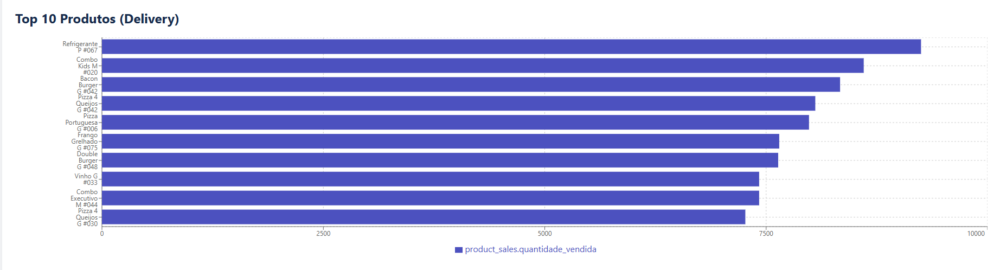
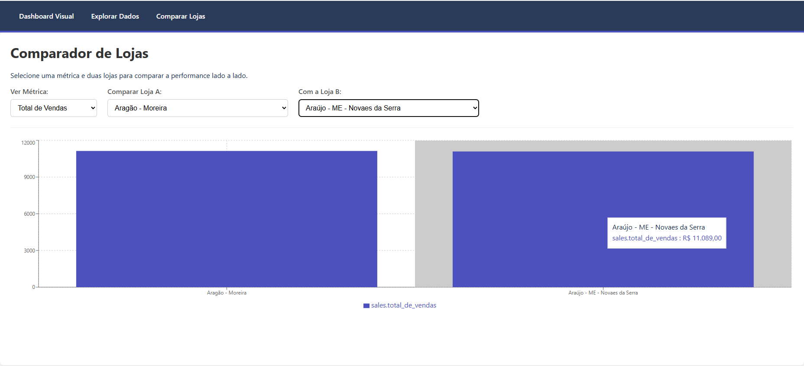
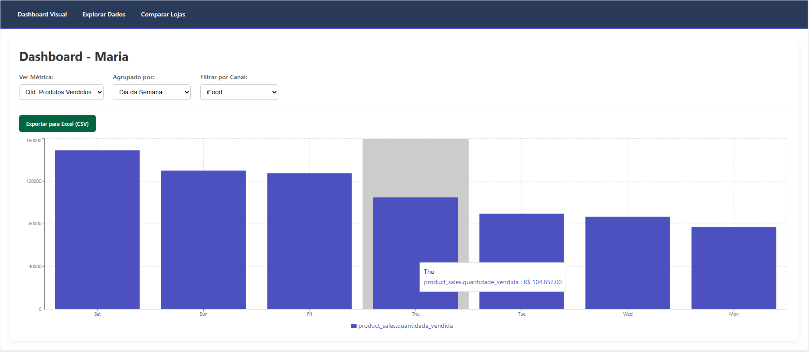
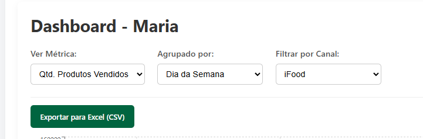

## Desafio Nola - Documentação de Arquitetura

Nome: Sofia Vaz

## 1. O Problema Central: A Dor da Maria (OLTP vs. OLAP)

A dor principal da usuária (Maria) é a incapacidade de explorar seus dados operacionais. Ela possui um banco de dados de produção (Postgres - OLTP), que é otimizado para escrever pedidos rapidamente (transações).
No entanto, suas perguntas são analíticas (OLAP), exigindo ler e agregar milhões de linhas (SUM, AVG, GROUP BY).
Rodar queries OLAP diretamente no banco OLTP (a "solução óbvia" com uma API REST) falharia miseravelmente nos critérios de avaliação:

Performance Lenta: Queries de BI demorariam de 10 a 30 segundos, criando uma péssima UX.

Risco Operacional: Queries analíticas pesadas poderiam sobrecarregar o banco, afetando a operação real do restaurante (os pedidos parariam de entrar).

A arquitetura escolhida foi desenhada especificamente para resolver este gargalo.

## 2. A Arquitetura Escolhida: Camada Semântica (Headless BI)

A solução foi implementar uma Camada Semântica (Headless BI) usando Cube.js.
Esta camada atua como um "cérebro" de BI, um servidor Node.js que fica entre o banco de dados e o front-end. Ele age como um "tradutor" que recebe perguntas de negócio simples do front-end (em JSON) e as converte em queries SQL otimizadas para o banco de dados.

Diagrama do Fluxo de Dados

Este diagrama ilustra como a solução funciona, desde a interação da usuária até a busca no banco de dados.

## 3. A Solução Focada no Usuário (UX/UI)

Para resolver o problema da Maria (que não é uma usuária técnica), a solução foi dividida em três páginas, atendendo a diferentes níveis de necessidade:

## 1. A "Visão Geral" (Página Home)

Esta é a página inicial, desenhada para facilidade de vizualização, com o objetivo de ser de fácil acesso. Ela não exige nenhum clique para gerar valor. Ela abre o app e as respostas para as perguntas mais comuns já estão lá.

KPI de Faturamento: Um card que mostra o faturamento dos últimos 6 meses.

Gráfico Top 10: Um gráfico de barras horizontal com os 10 produtos mais vendidos no delivery.

## 2. O "Explorador de Dados" (Página Explorar)

É a ferramenta para consulta para qualquer usuário que tenha uma nova pergunta.

Construtor Dinâmico: Permite que o usuário escolha dinamicamente a Métrica, a Dimensão de agrupamento e um Filtro de Canal.

Exportação de Relatório: Inclui um botão de "Exportar para Excel (CSV)" para que o usuário possa levar os dados para uma reunião com o sócio.

## 3. O "Comparador de Lojas" (Página Comparar)

Esta é uma feature dedicada para resolver uma dor de negócio específica e de alto valor: "comparar performance".

Seleção Lado-a-Lado: Permite que a Maria escolha uma Métrica e duas lojas específicas nos dropdowns.

Gráfico Comparativo: Renderiza um gráfico de barras simples mostrando a performance das duas lojas selecionadas, facilitando a tomada de decisão.

## 4. Justificativa das Decisões (Trade-offs)

Por que Cube.js? (O Back-end)

Performance (< 1s): O Cube.js foi escolhido por sua capacidade de gerenciar caching e pré-agregações. Ele é projetado para otimizar queries analíticas, garantindo que as respostas para a Maria (mesmo em 500k+ de linhas) sejam quase instantâneas.

Camada Semântica: Defini métricas de negócio (como ticket_medio, faturamento) e JOINs (como sales -> channels e sales -> stores) uma vez no back-end, em arquivos .yml fáceis de manter. Isso simplifica o front-end e garante que a "lógica de negócio" esteja centralizada.

API de BI: O Cube.js expõe uma API de altoível. O front-end não precisa "saber" SQL; ele apenas pede "me dê o faturamento por canal", e o Cube constrói a query SQL otimizada.

Por que React + Vite? (O Front-end)

UI Reativa: O React (com useState) foi a escolha natural para criar um dashboard que reage dinamicamente às seleções da Maria (mudando a métrica, a dimensão ou o filtro).

Ecossistema: Permitiu usar bibliotecas de gráficos (Recharts), roteamento (react-router-dom) e o cliente oficial do Cube.js (@cubejs-client/react) de forma nativa.

Performance de Build: O Vite foi usado para um setup de desenvolvimento rápido e moderno com TypeScript.

Alternativas Consideradas:

Alternativa A: API Node.js/Express + SQL Dinâmico:

Por que não? Poderia consumir muita performance. Construir JOINs e GROUP BYs dinâmicos em uma API REST poderia ser complexo, e as queries seriam lentas, pois bateriam direto no banco OLTP.

Alternativa B: ETL Completo + Data Warehouse:

Por que não? Excesso de engenharia para uma solução rápida. Criar um pipeline de ETL (com Airflow, etc.) para mover dados do Postgres para um BigQuery ou Snowflake seria a solução de produção "nível 100", mas inviável para o prazo do desafio. A Camada Semântica (Cube.js) oferece 80% do benefício de performance com 20% do esforço, provando o conceito.

## 5. Respondendo às Perguntas da Maria

A arquitetura escolhida permite que a Maria explore os dados e responda suas perguntas de negócio complexas em segundos.

Pergunta 1: "Ver overview do faturamento"

Solução: A Página Home (/) mostra um Card de KPI com o faturamento dos últimos 6 meses, sem necessidade de cliques.

Resultado (Print da Solução):

Pergunta 2: "Identificar os 10 produtos mais vendidos no delivery"

Solução: A Página Home (/) mostra um gráfico de barras horizontal com o Top 10 produtos, já filtrado por "Delivery".

Resultado (Print da Solução):

Pergunta 3: "Comparar performance de duas lojas"

Solução: A Página Comparar (/comparar) permite que a Maria selecione uma métrica (ex: "Total de Vendas") e duas lojas, mostrando um gráfico de barras lado-a-lado.

Resultado (Print da Solução):

Pergunta 4: "Quanto o iFood vende na quinta a noite?"

Solução: A Página Explorar (/explorar) permite esta análise complexa. A Maria pode selecionar:

Métrica: Faturamento

Agrupado por: Dia da Semana

Filtro: iFood

Resultado (Print da Solução):

Pergunta 5: "Exportar relatório para apresentar ao sócio"

Solução: A Página Explorar (/explorar) contém um botão "Exportar para Excel (CSV)" que baixa os dados do gráfico atual.

Resultado (Print da Solução):

## 6. Próximos Passos (Escalabilidade)

Esta solução está pronta para escalar:

Pré-Agregações: O próximo passo é configurar as preAggregations no Cube.js. Isso criaria tabelas materializadas no banco, permitindo que o dashboard funcione em bilhões de linhas com a mesma performance.

UI/UX: Adicionar um seletor de datas complexo (ex: "últimos 30 dias vs. 30 dias anteriores").
